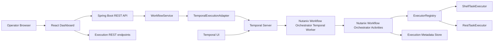
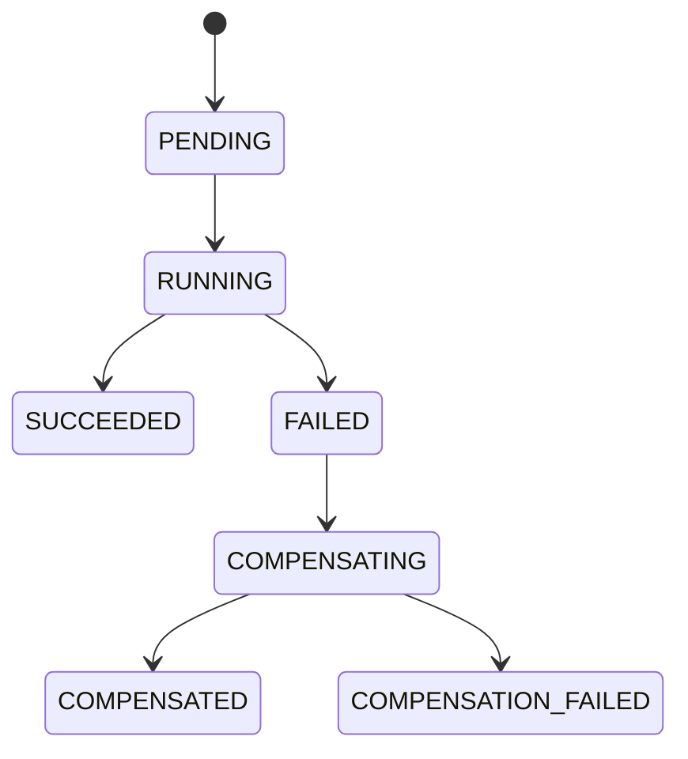
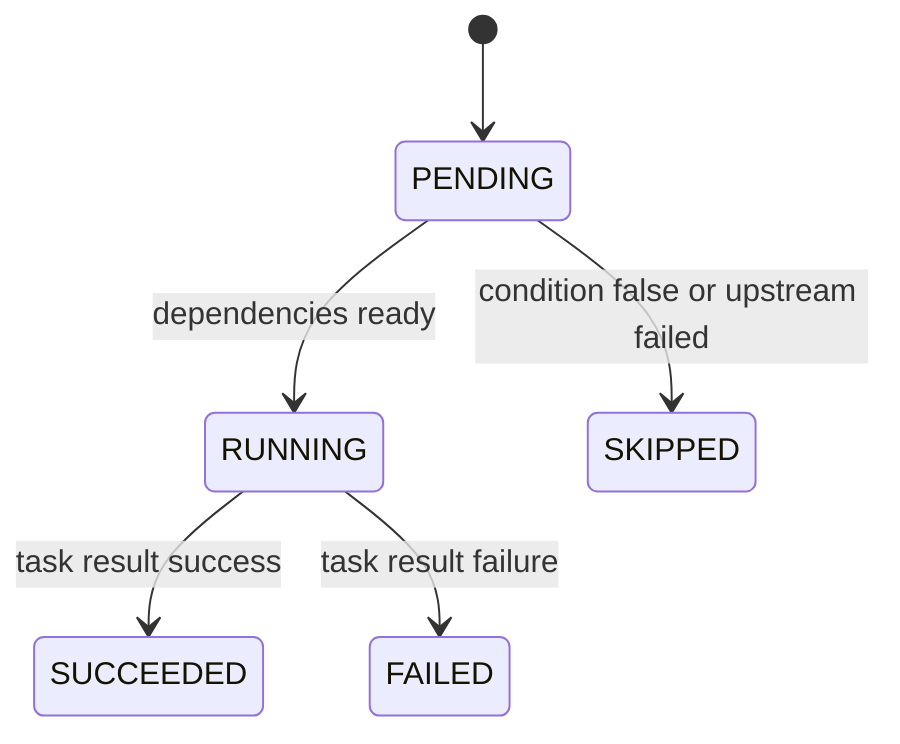

# Nutanix Workflow Orchestrator Design Document

## 1. Document Purpose

Nutanix Workflow Orchestrator is a configuration-driven workflow orchestration engine for infrastructure operations. It accepts workflow definitions as JSON, validates them as directed acyclic graphs (DAGs), executes shell and REST task nodes through pluggable executors, tracks execution state, invokes compensation workflows after failures, and exposes the result through a React dashboard and the Temporal UI.

This document explains:

- the system architecture and runtime boundaries;
- the DAG and finite-state-machine (FSM) model;
- the domain, execution, and persistence data models;
- the design principles applied to the implementation;
- how configuration drives workflow behavior;
- how a team creates and operates new workflows;
- the reasoning behind the major design decisions;
- the value Nutanix Workflow Orchestrator provides to an infrastructure-focused company;
- current limitations and the next production-hardening steps.

The document describes the current repository implementation. It does not present planned capabilities, such as database persistence or automatic retry policies, as if they already exist.

## 2. Executive Summary

Nutanix Workflow Orchestrator separates workflow intent from workflow execution:

```text
JSON workflow definition
          |
          v
WorkflowService -> DagValidator -> Workflow store
          |
          v
WorkflowExecutionPort
          |
          v
TemporalExecutionAdapter
          |
          v
Temporal workflow + activities
          |
          +--> ReadyNodeResolver
          +--> ExecutorRegistry
          |        +--> ShellTaskExecutor
          |        +--> RestTaskExecutor
          |
          v
Execution metadata -> REST API -> React dashboard
                              |
                              +--> Temporal UI link
```

The central architectural decision is that the DAG and the FSM are different things:

- The **DAG** describes topology: which tasks exist and which dependencies connect them.
- The **FSM** describes runtime state: what has happened to the workflow and to each node.
- The **scheduler** translates the current state plus the DAG into the next runnable nodes.
- The **executor registry** translates a node type into an implementation.
- **Temporal** provides durable workflow execution, task queues, workflow history, and worker coordination.
- The **dashboard** observes state. It does not own scheduling or mutate execution state directly.

This separation keeps the domain model understandable, makes task types extensible, and prevents infrastructure concerns from spreading through the application.

## 3. Problem and Goals

Infrastructure operations often cross several systems. A single operation may need to validate a request, reserve an address, call Prism Central, run a command, wait for a long-running operation, verify the result, and clean up if a later step fails.

Without an orchestration layer, these operations tend to become:

- manually executed runbooks;
- scripts with hidden ordering assumptions;
- tightly coupled integrations;
- difficult-to-observe background jobs;
- fragile workflows that disappear when a process crashes;
- inconsistent recovery procedures.

Nutanix Workflow Orchestrator addresses those problems with a small, explicit execution model.

### 3.1 Primary goals

1. Describe workflows as versioned JSON rather than hard-coding each flow into Java.
2. Support dependency-aware execution of sequential and parallel tasks.
3. Support conditional branches.
4. Support shell and REST task types through an extension point.
5. Represent failure and compensation explicitly.
6. Use Temporal as the durable runtime rather than implementing a custom distributed scheduler.
7. Make execution state observable through a dashboard and Temporal UI.
8. Keep domain logic testable without Spring or Temporal.

### 3.2 Deliberate non-goals in the current version

The current implementation does not yet provide:

- authentication, authorization, or tenant isolation;
- database-backed workflow definitions or dashboard metadata;
- real outbound shell or REST calls; the included executors simulate work;
- configurable retry policies in the application model;
- a workflow editor or drag-and-drop designer;
- WebSocket or server-sent-event updates;
- distributed worker autoscaling;
- secrets management;
- a policy engine for arbitrary expressions.

These are extension points, not reasons to make the initial engine more complicated.

## 4. High-Level Architecture

### 4.1 Logical layers

| Layer | Responsibility | Representative code |
|---|---|---|
| API | HTTP transport, request validation, DTO mapping | `api/WorkflowController`, `api/ExecutionController` |
| Application service | Register, validate, find, and submit workflows | `service/WorkflowService` |
| Domain | Workflow structure, task contracts, state enums, DAG validation | `domain/` |
| Engine | Scheduling and executor resolution abstractions | `engine/` |
| Temporal adapter | Connect the application port to Temporal SDK types | `temporal/TemporalExecutionAdapter` |
| Temporal runtime | Durable workflow loop, activity dispatch, child workflows | `temporal/Nutanix Workflow OrchestratorWorkflowImpl` |
| Executors | Perform a concrete task type | `executors/` |
| Metadata store | Keep definitions and dashboard execution projections | `persistence/InMemoryWorkflowStore` |
| Dashboard | List workflows, start runs, inspect state, link to Temporal | `dashboard/src/` |

### 4.2 Dependency direction

The intended dependency direction is inward toward the domain:

```text
API -> application service -> engine port -> Temporal adapter
                         |
                         +-> domain

Temporal implementation -> domain + engine abstractions
Executors              -> domain task contracts
Dashboard              -> REST API contract only
```

The domain package does not import Spring, Temporal, HTTP, or persistence classes. That is an important boundary: a workflow validator can be tested as a plain Java object, and the core workflow model does not know which runtime executes it.

### 4.3 Runtime deployment topology



Locally, Docker Compose supplies PostgreSQL, Temporal, and Temporal UI. Temporal uses PostgreSQL for its own service persistence. Nutanix Workflow Orchestrator's application-level metadata store is currently an in-memory repository, so restarting the Spring Boot process clears the dashboard catalog and execution metadata even though Temporal retains its own history.

### 4.4 Separation of concerns inside a workflow

In a Nutanix workflow orchestrator, separation of concerns applies inside the workflow definition as well as between software packages. Each workflow step represents one operational responsibility, not a collection of unrelated actions hidden inside one large script or executor. The orchestrator separates the concern of each workflow step so that provisioning, networking, policy, validation, notification, and recovery actions remain independently understandable and manageable.

Every step has its own:

- configuration and input contract;
- executor selected by its task type;
- dependency relationship in the DAG;
- runtime state in the FSM;
- output and error record;
- retry or recovery policy when those capabilities are enabled.

The workflow engine coordinates these concerns, but does not merge them into one implementation. This allows an infrastructure team to change a networking step without rewriting the VM step, observe the exact step that failed, and reuse the same step type across multiple Nutanix operational workflows.

For example, VM provisioning is intentionally split into steps such as:

```text
validate_blueprint
   |
   +--> reserve_ipam_address
   |
   +--> clone_ahv_image
          |
          v
        power_on_vm
          |
          v
        prism_health_check
```

Each step has a clear boundary:

| Workflow concern | Owning step | Why it is separate |
|---|---|---|
| Validate the requested blueprint | `validate_blueprint` | Fails early before infrastructure is changed |
| Reserve an address | `reserve_ipam_address` | Owns IPAM interaction and its output |
| Prepare the image | `clone_ahv_image` | Can run independently of IPAM reservation |
| Apply network policy | `attach_flow_categories` | Isolates Flow configuration from VM lifecycle work |
| Start the VM | `power_on_vm` | Runs only after image preparation succeeds |
| Verify health | `prism_health_check` | Provides a final observable acceptance check |

This design means that a step has one reason to change. A change to IPAM does not require changing image cloning. A failure in image cloning is visible as an image task failure rather than an opaque failure in a script containing six operations. A successful output can be passed to later steps through the execution context, and the dashboard can show the state and output of each responsibility independently.

The workflow definition therefore separates:

1. **Step intent:** the node's ID, type, and configuration.
2. **Step ordering:** the edges that express dependencies.
3. **Step execution:** the executor selected by the node type.
4. **Step state:** the node-level FSM state and result.
5. **Step recovery:** the compensation workflow that handles failed work.

Keeping these concerns separate prevents the workflow file from becoming a procedural program and lets the engine optimize independent steps without changing their implementation.

## 5. Domain and Data Modeling

### 5.1 Workflow definition model

The workflow definition is an immutable Java record composed of:

```text
WorkflowDefinition
  workflowName: String
  version: String
  input: Map<String, Object>
  nodes: List<WorkflowNode>
  edges: List<WorkflowEdge>
  onFailure: FailurePolicy?
```

Each node is:

```text
WorkflowNode
  id: String
  type: String
  config: Map<String, Object>
```

Each edge is:

```text
WorkflowEdge
  from: String
  to: String
  condition: String?
```

The domain records defensively copy maps and lists. This is a small but important encapsulation decision: once a definition enters the domain, callers cannot mutate the collections behind the record and silently change an executing workflow.

### 5.2 Workflow JSON contract

The current file format is:

```json
{
  "workflowName": "vm_provisioning",
  "version": "1.0",
  "input": {
    "vmName": "web-01",
    "cluster": "prod-ahv-a",
    "cpu": 4,
    "memoryMb": 8192
  },
  "nodes": [
    {
      "id": "validate",
      "type": "shell",
      "config": {
        "command": "calm blueprint validate web-tier",
        "delayMs": 650
      }
    },
    {
      "id": "allocate",
      "type": "rest",
      "config": {
        "method": "POST",
        "url": "/prism/v4/ipam/reservations",
        "delayMs": 800
      }
    }
  ],
  "edges": [
    ["validate", "allocate"]
  ],
  "onFailure": {
    "compensationFlow": "cleanup_failed_ahv_vm"
  }
}
```

The HTTP DTO accepts the same conceptual structure. `WorkflowMapper` converts request DTOs into domain records so API representation and domain representation remain separate contracts.

### 5.3 Execution data model

Workflow-level state is represented by `ExecutionState`:

```text
PENDING
RUNNING
SUCCEEDED
FAILED
COMPENSATING
COMPENSATED
COMPENSATION_FAILED
```

Node-level state is represented by `NodeExecutionState`:

```text
PENDING
RUNNING
SUCCEEDED
FAILED
SKIPPED
```

An `ExecutionRecord` contains:

| Field | Meaning |
|---|---|
| `id` | Nutanix Workflow Orchestrator execution identifier |
| `workflowName` | Definition selected for the run |
| `version` | Definition version |
| `state` | Current workflow FSM state |
| `startedAt`, `finishedAt` | Execution timing |
| `input` | Effective input used by the run |
| `nodes` | Per-node execution projections |
| `failureReason` | First or primary failure explanation |
| `compensationExecutionId` | Related compensation run, if any |
| `temporalWorkflowId` | Temporal workflow identifier |
| `temporalRunId` | Temporal run identifier |
| `temporalNamespace` | Temporal namespace |
| `temporalTaskQueue` | Worker task queue |

An `ExecutionNodeRecord` stores node identity, executor type, state, timestamps, output, and error. The dashboard uses this projection for fast rendering; Temporal remains the durable execution system and source of workflow history.

### 5.4 Task request and result

The executor boundary uses two small data contracts:

```text
TaskRequest
  nodeId
  type
  config
  workflowInput
  previousOutputs

TaskResult
  success
  output
  error
```

Normal task failure is represented as a `TaskResult.failure(...)`, not as a control-flow exception. This makes the workflow implementation responsible for deciding whether to fail, compensate, or continue, rather than allowing arbitrary executor exceptions to define orchestration semantics.

## 6. DAG Architecture

### 6.1 What the DAG means

The DAG is the declarative graph of work. A directed edge `A -> B` means that B depends on A. A node with no incoming edges can start immediately. A node with multiple incoming edges becomes ready only when all required incoming conditions are satisfied.

The graph is validated before registration or execution.

### 6.2 Validation rules

`DagValidator` currently enforces:

1. A workflow name is present.
2. At least one node exists.
3. Every node has an ID and type.
4. Node IDs are unique.
5. Every edge references known nodes.
6. The graph contains no cycles.
7. Every declared node is reachable from the first node.

Cycle detection uses depth-first traversal with `visiting` and `visited` sets. Reachability uses a breadth-first traversal from the first declared node. Rejecting invalid topology before Temporal starts prevents malformed workflows from becoming long-lived runtime failures.

### 6.3 Parallelism

When several nodes are ready, `Nutanix Workflow OrchestratorWorkflowImpl` starts them together using Temporal asynchronous functions. The scheduler returns a list rather than a single node specifically to allow independent branches to run concurrently.

For example:

```text
                 +--> reserve_ipam_address --+
validate_blueprint                         +--> prism_health_check
                 +--> clone_ahv_image -------+
```

The workflow waits for the ready promises, records each result, and only then evaluates the next scheduling cycle.

### 6.4 Conditional branches

An edge may contain a simple condition:

```json
["assess_policy_risk", "generate_monitor_policy", "input.policyMode == monitor"]
```

The current `ConditionEvaluator` supports equality and inequality expressions against:

- `input.<path>`;
- `outputs.<nodeId>.<path>`.

Values may be strings or booleans. Conditions are intentionally limited rather than exposing arbitrary code execution inside workflow definitions.

### 6.5 Skipping rules

`ReadyNodeResolver` distinguishes two concepts:

- **Ready:** all incoming dependencies have succeeded and their conditions match.
- **Skipped:** dependencies are terminal, but at least one incoming condition is not satisfied.

If a task fails, the runtime marks remaining pending nodes as skipped before entering the failure/compensation path. This gives operators an accurate explanation: those tasks did not remain mysteriously pending; they were intentionally prevented from running after the failure.

## 7. FSM and Runtime State Architecture

### 7.1 Workflow FSM

The normal lifecycle is:



If no compensation flow exists, a failure ends in `FAILED`. If compensation exists, the failed workflow enters `COMPENSATING`, runs a child workflow, and ends in either `COMPENSATED` or `COMPENSATION_FAILED`.

### 7.2 Node FSM



The workflow-level FSM and node-level FSM are intentionally separate. A workflow can be `COMPENSATING` while its original nodes contain a mixture of `SUCCEEDED`, `FAILED`, and `SKIPPED` states.

### 7.3 Runtime loop

The Temporal workflow implementation follows this sequence:

1. Create all node states as `PENDING`.
2. Publish workflow `RUNNING`.
3. Resolve conditionally skipped nodes.
4. Resolve ready nodes.
5. If no nodes are ready while pending nodes remain, fail with a no-runnable-nodes reason.
6. Mark ready nodes `RUNNING` and invoke activities asynchronously.
7. Collect task results.
8. Mark successful nodes `SUCCEEDED`, failed nodes `FAILED`, and collect outputs.
9. If a failure occurred, mark remaining pending nodes `SKIPPED` and enter failure handling.
10. Otherwise publish progress and repeat until no pending nodes remain.
11. Publish `SUCCEEDED` when the graph completes.

## 8. Temporal Integration

### 8.1 Why Temporal is behind an adapter

The application depends on `WorkflowExecutionPort`, not directly on the Temporal client. `TemporalExecutionAdapter` is the infrastructure adapter that:

1. creates a Nutanix Workflow Orchestrator execution ID;
2. saves an initial dashboard record;
3. creates a Temporal workflow stub with the configured task queue;
4. starts the Temporal workflow with the immutable definition and input;
5. stores Temporal workflow and run IDs in the execution record.

This is dependency inversion in practice. If the execution substrate changed later, the service contract could remain stable while the adapter changed.

### 8.2 Temporal workflow and activities

`Nutanix Workflow OrchestratorWorkflowImpl` is a Temporal workflow implementation. It owns deterministic orchestration decisions: state transitions, dependency evaluation, asynchronous activity invocation, and child compensation workflow dispatch.

`Nutanix Workflow OrchestratorActivitiesImpl` is the activity implementation. It performs side effects by resolving the task type through `ExecutorRegistry`, and it publishes execution projections to the metadata store.

The worker is configured in `TemporalConfiguration`:

- `WorkflowServiceStubs` connects to the configured Temporal target;
- `WorkflowClient` uses the configured namespace;
- `WorkerFactory` creates a worker for the configured task queue;
- the worker registers `Nutanix Workflow OrchestratorWorkflowImpl` and `Nutanix Workflow OrchestratorActivitiesImpl`.

### 8.3 Failure and compensation

Compensation is modeled as a normal workflow, not as an implicit reverse traversal.

```text
ahv_vm_provisioning fails
          |
          v
Nutanix Workflow OrchestratorWorkflowImpl loads cleanup_failed_ahv_vm
          |
          v
Temporal child workflow executes compensation DAG
          |
          v
COMPENSATED or COMPENSATION_FAILED
```

This is a better model for infrastructure operations because many actions cannot be reversed mechanically. A reservation may need an explicit release call; a VM may need a delete operation; a notification may need to be sent. Compensation is therefore an intentional operational workflow.

### 8.4 Temporal UI correlation

Every dashboard execution stores the Temporal namespace, workflow ID, and run ID. The dashboard builds a Temporal UI history URL from those fields. Operators can move from the business-facing Nutanix Workflow Orchestrator view to Temporal's event history without searching manually.

## 9. Configuration-Driven Design

### 9.1 What is configuration-driven

The workflow topology, task ordering, task types, task configuration, default input, conditions, and compensation relationship are data in JSON files. They are not Java control flow.

At startup, `DataSeeder`:

1. reads the directory configured by `Nutanix Workflow Orchestrator.workflow-directory`;
2. finds `.json` files;
3. deserializes them into `WorkflowDefinitionRequest` objects;
4. maps them into domain definitions;
5. registers them through `WorkflowService`;
6. relies on `DagValidator` for validation.

The directory defaults to `workflows`, and can be changed with:

```properties
Nutanix Workflow Orchestrator.workflow-directory=${Nutanix Workflow Orchestrator_WORKFLOW_DIRECTORY:workflows}
```

Temporal runtime settings are also externalized:

```properties
Nutanix Workflow Orchestrator.temporal.target=${TEMPORAL_ADDRESS:127.0.0.1:7233}
Nutanix Workflow Orchestrator.temporal.namespace=${TEMPORAL_NAMESPACE:default}
Nutanix Workflow Orchestrator.temporal.task-queue=${TEMPORAL_TASK_QUEUE:Nutanix Workflow Orchestrator}
```

### 9.2 Benefits of configuration-driven workflows

- Operations teams can review a flow as a versioned artifact.
- Topology changes do not require changing orchestration code.
- Workflow definitions can be promoted through environments.
- The same runtime can execute provisioning, upgrade, cleanup, and policy flows.
- A definition can be validated independently of execution.
- The dashboard can list and run newly added definitions after restart.

### 9.3 Configuration boundaries

Configuration should describe intent, not contain arbitrary executable application code. The current engine intentionally supports a narrow task configuration contract. In a production implementation, shell commands, URLs, credentials, and environment-specific values should be referenced through approved templates, secret stores, or integration profiles rather than placed directly in unrestricted JSON.

## 10. How to Create a New Workflow

### 10.1 File-based workflow creation

1. Create a new `.json` file under `workflows/`.
2. Choose a unique `workflowName`.
3. Set a version.
4. Define default input values.
5. Add nodes with unique IDs and supported types.
6. Put executor-specific values under `config`.
7. Add edges for dependencies.
8. Add conditions to edges when branching is required.
9. Add `onFailure.compensationFlow` when cleanup is necessary.
10. Restart the backend so `DataSeeder` loads the definition.
11. Confirm it appears in `GET /api/workflows` and the dashboard.
12. Run it from the dashboard and verify the Temporal UI link.

### 10.2 Example: a new verification workflow

```json
{
  "workflowName": "cluster_health_verification",
  "version": "1.0",
  "input": {
    "cluster": "prod-ahv-a"
  },
  "nodes": [
    {
      "id": "check_cluster",
      "type": "rest",
      "config": {
        "method": "GET",
        "url": "/prism/v4/clusters/prod-ahv-a/health",
        "delayMs": 500
      }
    },
    {
      "id": "publish_result",
      "type": "rest",
      "config": {
        "method": "POST",
        "url": "/operations/health-results",
        "delayMs": 400
      }
    }
  ],
  "edges": [
    ["check_cluster", "publish_result"]
  ]
}
```

### 10.3 Creating a new executor type

The extension path is intentionally separate from workflow creation:

1. Implement `TaskExecutor`.
2. Return a unique string from `type()`.
3. Read only the configuration required by that executor.
4. Return `TaskResult.success(...)` or `TaskResult.failure(...)`.
5. Register the implementation as a Spring component.
6. Use the new type in JSON.

For example, adding `DockerTaskExecutor` should not require changes to `WorkflowService`, `ReadyNodeResolver`, `Nutanix Workflow OrchestratorWorkflowImpl`, or the dashboard. Spring injects all executor beans into `ExecutorRegistry`, which resolves them by type.

## 11. API and Dashboard Design

### 11.1 API surface

| Method | Endpoint | Purpose |
|---|---|---|
| `GET` | `/api/workflows` | List registered definitions |
| `GET` | `/api/workflows/{name}` | Fetch a definition |
| `POST` | `/api/workflows` | Register a definition through the API |
| `POST` | `/api/workflows/{name}/execute` | Start a run with optional input |
| `GET` | `/api/executions` | List dashboard execution records |
| `GET` | `/api/executions/{id}` | Fetch one execution record |

The controllers remain thin. They delegate lookup, validation, and execution to services rather than implementing business rules in HTTP handlers.

### 11.2 Dashboard behavior

The React app:

- loads workflow definitions and executions in parallel;
- refreshes them every three seconds;
- provides a run action for each workflow;
- shows workflow and node states;
- shows task outputs and errors;
- shows conditional/skipped nodes;
- links each run to Temporal UI;
- provides a DAG visualization and execution timeline.

The dashboard is deliberately a projection and control surface, not a second workflow engine. It does not decide dependency readiness, run task code, or reconstruct Temporal history.

## 12. Design Principles and Concrete Evidence

### 12.1 Separation of concerns

Each concern has a home:

- topology validation: `DagValidator`;
- readiness and branching: `ReadyNodeResolver` and `ConditionEvaluator`;
- task dispatch: `ExecutorRegistry`;
- task behavior: concrete executors;
- durability: Temporal package;
- HTTP transport: controllers;
- dashboard projection: persistence and query services;
- presentation: React components.

This reduces the blast radius of change. A new condition rule should not require editing a controller. A new UI table column should not change the Temporal workflow.

### 12.2 Single Responsibility Principle

Examples:

- `WorkflowService` coordinates application use cases.
- `DagValidator` validates graph structure.
- `ReadyNodeResolver` decides readiness.
- `ShellTaskExecutor` handles shell semantics.
- `Nutanix Workflow OrchestratorActivitiesImpl` bridges activities and execution metadata.
- `ExecutionQueryService` serves dashboard queries.

The classes collaborate rather than becoming one large workflow manager.

### 12.3 Open-Closed Principle

The executor registry is the clearest example. The engine is open to new task types but closed to edits when a new executor is added. Adding a new executor is additive: implement the interface and register the bean.

The configuration model applies the same principle at a higher level: add a new workflow file instead of adding a new Java method for each operational flow.

### 12.4 Abstraction

Two abstractions matter most:

- `TaskExecutor` hides how a task type performs work.
- `WorkflowExecutionPort` hides which durable runtime starts and tracks executions.

The rest of the application depends on capabilities, not concrete infrastructure.

### 12.5 Encapsulation

Encapsulation appears in several places:

- domain records defensively copy mutable collections;
- `ExecutorRegistry` hides its type-to-executor map;
- `WorkflowService` hides definition lookup and validation sequencing;
- the dashboard consumes a stable API instead of reading store internals;
- condition parsing is private to `ConditionEvaluator`.

### 12.6 Dependency Inversion

`WorkflowService` depends on `WorkflowExecutionPort`, not `TemporalExecutionAdapter`. Temporal is an implementation detail selected by dependency injection. This also makes a fake execution port possible for service tests.

### 12.7 Composition over inheritance

The runtime is composed from a resolver, registry, activities implementation, store, and executors. It does not rely on a deep hierarchy of workflow subclasses. Compensation composes the same workflow implementation with another definition through a child workflow.

### 12.8 Interface Segregation

The interfaces are small:

- `TaskExecutor` exposes only type identification and execution.
- `WorkflowExecutionPort` exposes submission and status lookup.
- Temporal workflow and activity interfaces expose only the operations Temporal needs.

Small contracts reduce accidental coupling.

### 12.9 Immutability and defensive copying

Workflow definitions and task results are record-based and copy incoming maps/lists where appropriate. This is important because Temporal workflow decisions should be based on stable input, not a mutable object being changed by another layer.

### 12.10 Fail-fast validation

Invalid names, node IDs, types, edge references, cycles, and unreachable nodes are rejected before a workflow is accepted. Failing at registration is cheaper and clearer than discovering malformed topology after a production run starts.

### 12.11 Least knowledge

Controllers do not know Temporal details. Executors do not know the dashboard. The dashboard does not know scheduler rules. Each component talks to the narrow contract it needs.

### 12.12 Workflow-step isolation

At workflow level, each node follows the same system-wide rule: one step, one responsibility, one executor contract, and one observable result. A node should not reach into another node's implementation or directly mutate global workflow state. It receives declared input and previous outputs through `TaskRequest`, and it returns a `TaskResult`.

This isolation improves:

- **Changeability:** replace or revise one operation without rewriting the entire workflow.
- **Testability:** test a task executor with a small request rather than booting the full engine.
- **Observability:** identify the exact operation that is running, failed, succeeded, or skipped.
- **Parallelism:** run independent nodes concurrently when their edges do not impose a dependency.
- **Recovery:** compensate completed responsibilities with explicit cleanup steps.
- **Reuse:** use the same executor type and step pattern in multiple workflows.

The edge list is the only place where ordering is declared. The node implementation does not need to know whether it runs first, in parallel, or after a branch. That decision belongs to the scheduler and the graph.

## 13. System-Wide Optimization Through the Design Rules

The architecture is optimized by applying the same rules consistently at every level. Optimization here does not mean compressing code or making every operation run in parallel. It means reducing unnecessary coupling, work, risk, and operational ambiguity while preserving correctness.

### 13.1 Optimize change impact

Configuration-driven workflows move routine process changes into JSON. Executor abstractions move integration changes into one implementation. The Temporal port prevents runtime changes from spreading through services and controllers. Together, these boundaries reduce the number of files and teams affected by a change.

```text
New workflow         -> add or update JSON
New task capability  -> add one TaskExecutor
New runtime          -> add one WorkflowExecutionPort adapter
New dashboard view   -> consume existing REST projection
```

### 13.2 Optimize execution time safely

The scheduler returns all currently ready nodes, not only the first ready node. Independent steps can therefore run concurrently through Temporal asynchronous functions. The dependency graph remains the correctness boundary: the engine never parallelizes nodes that have an unsatisfied dependency.

For example, IPAM reservation and image cloning can happen in parallel after blueprint validation. The final health check waits for both network and VM prerequisites. This reduces elapsed time without sacrificing ordering guarantees.

### 13.3 Optimize failure diagnosis

Small workflow steps create a narrow failure domain. Instead of reporting that a large provisioning script failed, Nutanix Workflow Orchestrator can report that `reserve_ipam_address` failed, preserve its error and output, mark downstream work skipped, and dispatch the configured compensation flow. This reduces time to diagnose and prevents operators from repeating already-successful work.

### 13.4 Optimize recovery work

Compensation is modeled as a separate workflow containing only the cleanup responsibilities needed for the failed operation. It is not a blind reverse traversal of the original DAG. This avoids executing cleanup actions that do not apply and lets the company evolve recovery flows independently from forward flows.

### 13.5 Optimize cognitive load

System-wide naming, state enums, request/result contracts, and executor interfaces give every workflow the same mental model. An operator who understands one workflow can understand another because the same rules apply:

- nodes have one responsibility;
- edges express dependencies;
- conditions control branches;
- states explain progress;
- compensation explains recovery;
- outputs explain what each step produced.

Consistency is an operational optimization: it reduces training time and makes reviews faster.

### 13.6 Optimize testing and quality control

Because the workflow is divided into validation, scheduling, execution, persistence, and presentation concerns, tests can be focused. A DAG test does not need Temporal. An executor test does not need the dashboard. A dashboard build does not need to run an infrastructure command. This shortens feedback cycles and makes failures easier to localize.

### 13.7 Optimize organizational ownership

The same boundaries allow teams to own parts of the system without editing one another's code:

| Team concern | Stable ownership boundary |
|---|---|
| Workflow authors | JSON definitions, nodes, edges, conditions |
| Platform engineers | scheduler, state model, Temporal adapter |
| Integration engineers | task executor implementations |
| API engineers | DTOs and HTTP contracts |
| Operations and SRE | dashboard, execution history, compensation definitions |
| Security engineers | executor policies, secrets, authorization, approvals |

This ownership model is possible because the systemwide rules make the boundaries explicit.

### 13.8 Optimize for safe extension, not premature abstraction

The design keeps abstractions at real change points. `TaskExecutor` exists because task types will grow. `WorkflowExecutionPort` exists because runtime durability is infrastructure. The engine does not introduce abstractions for every class or hide simple data transformations behind factories. This keeps the codebase small while preserving the extension points that matter.

## 14. Design Journey and Reasoning

### Step 1: Start from the operational problem

The initial problem was not "build a UI" or "wrap Temporal." It was to represent multi-step infrastructure operations with ordering, parallelism, failure handling, and visibility. That led to a workflow definition as the primary domain object.

### Step 2: Choose a DAG for topology

Infrastructure operations often have independent branches. A simple linear list would force unnecessary serialization. A DAG expresses both linear dependencies and parallel branches while giving the validator a clear way to reject cycles.

### Step 3: Separate topology from runtime state

A graph answers "what may depend on what." It does not answer "what is running right now." Mixing those concepts makes failure behavior difficult to reason about. The design therefore introduced separate workflow and node FSMs.

### Step 4: Add a scheduler boundary

The runtime should not contain scattered dependency checks. `ReadyNodeResolver` centralizes readiness and branch skipping. That makes scheduling independently testable and keeps the Temporal workflow loop readable.

### Step 5: Add task polymorphism

Shell commands and REST calls have different execution semantics, but the scheduler should treat them uniformly. `TaskExecutor` became the stable task boundary, and `ExecutorRegistry` became the composition point for new types.

### Step 6: Avoid building a custom durable runtime

Crash recovery, worker coordination, task queues, history, and durable execution are difficult infrastructure problems. Temporal already provides those capabilities. The design places Temporal behind an adapter so Nutanix Workflow Orchestrator owns workflow semantics while Temporal owns execution durability.

### Step 7: Model compensation explicitly

Generic rollback is unsafe for infrastructure actions. A cleanup flow is more honest: it is a deliberate DAG of compensating actions. Reusing the same workflow runtime for compensation avoids a second execution model.

### Step 8: Make definitions configuration-driven

Once the runtime was generic, hard-coded Java workflows became unnecessary duplication. JSON files became the operational contract. Startup loading keeps the demo simple while the API also supports registration.

### Step 9: Add observability after execution semantics

The dashboard was added after the domain, scheduler, and Temporal path. That order matters: the UI observes a real execution model rather than inventing a separate front-end state machine. Temporal IDs are retained so operators can move from summarized business state to authoritative workflow history.

### Step 10: Correct edge cases through observed behavior

Two important UX rules came from inspecting runtime behavior:

- conditionally skipped nodes must not display an ever-increasing timer;
- nodes after a failed task must be explicitly marked skipped rather than left pending.

Those fixes were placed in the owning layers: the activity projection avoids assigning start timestamps to skipped nodes, the workflow runtime marks pending nodes skipped on failure, and the dashboard renders a fixed `Skipped` label.

## 15. Company Value

### 15.1 Standardized operations

Teams can encode common infrastructure procedures once and reuse them. This reduces variation between operators and makes the intended sequence reviewable.

### 15.2 Lower operational risk

Explicit dependencies and validation prevent accidental ordering errors. Compensation flows make recovery part of the design instead of an undocumented emergency procedure.

### 15.3 Faster delivery of integrations

The executor extension point lets a company add capabilities such as Prism Central, Calm, IPAM, ticketing, backup, database, or cloud operations without rewriting the scheduler.

### 15.4 Better incident response

Operators can see which task failed, which tasks succeeded, which were skipped, why compensation ran, and where the execution lives in Temporal history.

### 15.5 Auditability and repeatability

Versioned JSON definitions plus Temporal workflow history provide a foundation for answering:

- What definition ran?
- With what input?
- Which steps ran in parallel?
- What failed?
- What cleanup happened?
- Which runtime execution contains the authoritative history?

### 15.6 Safer automation at scale

The design supports moving from manually executed runbooks toward governed automation. With production hardening, definitions could be reviewed, approved, promoted, and executed through a controlled platform.

## 16. Current Limitations and Production Hardening

### 16.1 Replace in-memory metadata storage

`InMemoryWorkflowStore` is suitable for a focused prototype, but restart loses application metadata. A production version should persist workflow definitions, versions, execution projections, and node records in PostgreSQL. Temporal history should remain in Temporal rather than being duplicated in full.

### 16.2 Implement real integrations safely

The current shell and REST executors simulate delays and outputs. Production executors need:

- strict command allowlists or isolated workers;
- HTTP timeouts and status handling;
- authentication and secret references;
- output size limits;
- redaction of sensitive data;
- idempotency keys;
- audit records.

### 16.3 Add retry and timeout policy to the model

Temporal activity options currently provide a five-minute start-to-close timeout. A production definition should support validated retry, backoff, heartbeat, and timeout policies per task while keeping those policies outside executor implementations.

### 16.4 Add security boundaries

The API needs authentication, authorization, role-based workflow permissions, tenant isolation, and protection against arbitrary command execution. Workflow definitions should be signed or approved before production execution.

### 16.5 Improve state delivery

Polling every three seconds is simple and adequate for the prototype. Server-sent events or WebSockets could reduce latency and server load for high-volume operations.

### 16.6 Version and migration policy

Workflow versions should be immutable once executions reference them. New definitions should create a new version, and running Temporal workflows should continue using the definition snapshot they started with.

### 16.7 Operational controls

Future controls should include cancellation, pause/resume where semantically safe, concurrency limits, schedules, approvals, rate limits, and environment-specific policy checks.

## 17. Testing Strategy

The testing approach follows the boundaries:

- `DagValidatorTest` verifies invalid topology rules.
- `ReadyNodeResolverTest` verifies dependency readiness, conditions, and failed-dependency skipping.
- executor tests should verify input validation, simulated failure, output mapping, and delays without requiring Temporal.
- service tests can use a fake `WorkflowExecutionPort`.
- integration tests should start Temporal and verify workflow submission, state publication, and compensation.
- dashboard checks should verify build correctness and, later, browser behavior for loading, execution, skipped nodes, failure state, and Temporal links.

The most valuable tests are not broad snapshots. They are tests that prove the architecture's invariants: no cycles, no unknown edges, correct readiness, explicit skipping, deterministic failure routing, and stable executor resolution.

## 18. Operational Runbook

Start infrastructure:

```powershell
docker compose up -d
```

Start the backend from the repository root:

```powershell
.\mvnw.cmd spring-boot:run
```

Start the dashboard in another terminal:

```powershell
cd dashboard
npm install
npm run dev
```

Open:

- Nutanix Workflow Orchestrator dashboard: `http://127.0.0.1:5173`
- Nutanix Workflow Orchestrator API: `http://127.0.0.1:8080`
- Temporal UI: `http://127.0.0.1:8088`

To add a workflow, place a valid JSON definition in `workflows/` and restart the backend. The dashboard refreshes its catalog from `GET /api/workflows`.

## 19. Final Architecture Statement

Nutanix Workflow Orchestrator is intentionally a domain layer over a durable execution substrate. Its value is not merely that it starts Temporal workflows. Its value is the set of clear contracts around Temporal:

- JSON expresses operational intent.
- Domain records express validated workflow structure.
- The DAG expresses dependency topology.
- The FSM expresses runtime truth.
- The scheduler determines readiness.
- The executor registry enables extension.
- Compensation is an explicit workflow.
- The adapter isolates Temporal.
- The dashboard makes state useful to operators.

That design gives a company a foundation on which infrastructure automation can grow without turning every new workflow, integration, or UI requirement into a rewrite of the core engine.
