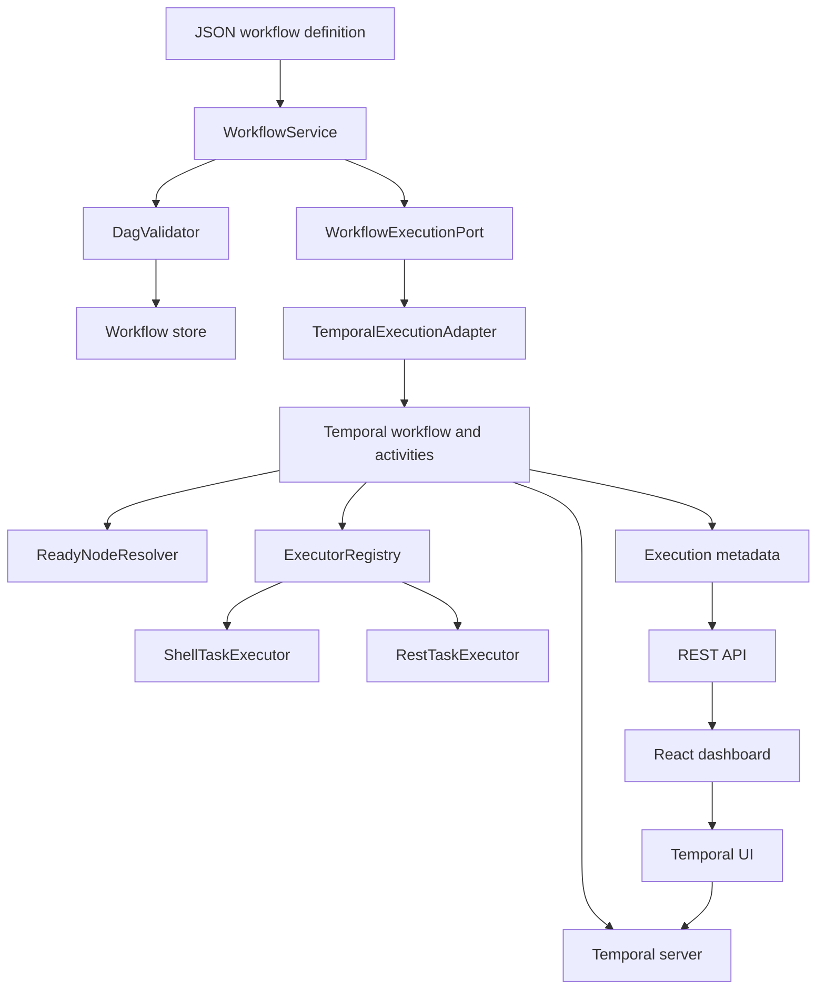

# Nutanix Workflow Orchestrator

[GitHub repository](https://github.com/who-else-but-arjun/nutanix-workflow-orchestrator)

A Temporal-backed, configuration-driven workflow engine for Nutanix-style infrastructure operations.

The orchestrator accepts JSON workflow definitions, validates their DAG topology, runs independent steps in parallel when dependencies allow it, tracks workflow and node state, dispatches compensation workflows after failures, and exposes execution details through a React dashboard and Temporal UI.

## What It Solves

Infrastructure procedures often combine validation, IPAM, Prism Central, AHV, Flow policy, shell commands, REST calls, health checks, and cleanup. This project turns those procedures into explicit, reviewable workflows instead of large scripts or manual runbooks.

Each workflow step owns one concern:

- its configuration and input contract;
- its executor type;
- its DAG dependencies;
- its runtime state;
- its output and error;
- its recovery boundary.

This makes workflows easier to change, test, observe, reuse, and recover.

## Architecture



The design separates:

- **DAG:** declarative workflow topology and dependencies.
- **FSM:** runtime state of the workflow and every node.
- **Scheduler:** decides which nodes are ready or skipped.
- **Executor:** performs one task type.
- **Temporal:** provides durable execution and workflow history.
- **Dashboard:** observes and starts executions without owning orchestration logic.

See [DESIGN_DOCUMENT.md](DESIGN_DOCUMENT.md) for the complete architecture, data model, design principles, design journey, and production-hardening roadmap.

## Technology

- Java 17+ and Spring Boot 3
- Temporal Java SDK
- Maven
- React, TypeScript, and Vite
- Docker Compose for PostgreSQL, Temporal, and Temporal UI

## Run Locally

### Prerequisites

- Java 17 or newer
- Node.js and npm
- Docker Desktop

### Start Temporal and PostgreSQL

From the repository root:

```powershell
docker compose up -d
```

### Start the backend

Open a PowerShell terminal in the repository root:

```powershell
.\mvnw.cmd spring-boot:run
```

The backend runs at `http://127.0.0.1:8080`.

### Start the dashboard

Open a second PowerShell terminal:

```powershell
cd dashboard
npm install
npm run dev
```

Open the dashboard at `http://127.0.0.1:5173`.

Temporal UI is available at `http://127.0.0.1:8088`.

### Stop local services

Stop the backend and dashboard with `Ctrl+C`, then run:

```powershell
docker compose down
```

## Workflow Definitions

Workflow definitions live in [`workflows/`](workflows/). The backend loads every `.json` file from that directory at startup using `flowforge.workflow-directory`, which defaults to `workflows`.

The included definitions demonstrate:

- parallel AHV VM provisioning;
- failure and compensation;
- a long-running AOS/LCM upgrade;
- conditional Flow microsegmentation rollout;
- cleanup of partially completed infrastructure work.

### Workflow JSON shape

```json
{
      "workflowName": "cluster_health_verification",
      "version": "1.0",
      "input": {
            "cluster": "prod-ahv-a"
      },
      "nodes": [
            {
                  "id": "check_cluster",
                  "type": "rest",
                  "config": {
                        "method": "GET",
                        "url": "/prism/v4/clusters/prod-ahv-a/health",
                        "delayMs": 500
                  }
            },
            {
                  "id": "publish_result",
                  "type": "rest",
                  "config": {
                        "method": "POST",
                        "url": "/operations/health-results",
                        "delayMs": 400
                  }
            }
      ],
      "edges": [
            ["check_cluster", "publish_result"]
      ]
}
```

To create a workflow:

1. Add a `.json` file under `workflows/`.
2. Give every node a unique ID and supported type.
3. Add edges for dependencies.
4. Add conditions to edges when branching is needed.
5. Add `onFailure.compensationFlow` when cleanup is required.
6. Restart the backend.
7. Confirm the workflow appears in `GET /api/workflows` and the dashboard.

Conditional edges can use expressions such as:

```json
["assess_policy_risk", "generate_monitor_policy", "input.policyMode == monitor"]
```

Supported expressions compare values from `input.*` or `outputs.<nodeId>.*` using `==` or `!=`.

## Extending Task Types

Task types follow the Open-Closed Principle. Implement `TaskExecutor`, expose a unique `type()`, return a `TaskResult`, and register the class as a Spring component.

```java
@Component
public class DockerTaskExecutor implements TaskExecutor {
            @Override
            public String type() {
                        return "docker";
            }

            @Override
            public TaskResult execute(TaskRequest request) {
                        return TaskResult.success(Map.of("status", "completed"));
            }
}
```

The scheduler, workflow runtime, API, and dashboard do not need to change when a new executor is added.

## API

```http
GET  /api/workflows
GET  /api/workflows/{name}
POST /api/workflows
POST /api/workflows/{name}/execute
GET  /api/executions
GET  /api/executions/{id}
```

The dashboard polls execution metadata and includes a direct link to the matching Temporal workflow history.

## Design Principles

- **Separation of concerns:** every workflow step owns one operational responsibility; the API, domain, scheduler, executors, Temporal adapter, persistence projection, and dashboard have separate boundaries.
- **Open-Closed Principle:** add a new workflow through JSON or a new task type through `TaskExecutor` without changing the engine.
- **DAG/FSM separation:** the DAG defines what may run; the FSM records what is running, completed, failed, or skipped.
- **Abstraction:** `TaskExecutor` and `WorkflowExecutionPort` hide changing implementation details.
- **Encapsulation:** domain records defensively copy collections and registries hide internal maps.
- **Dependency inversion:** application services depend on `WorkflowExecutionPort`, not directly on Temporal.
- **Composition over inheritance:** the runtime is composed from a scheduler, registry, store, activities, and executors.
- **Fail-fast validation:** invalid node IDs, edge references, cycles, and unreachable nodes are rejected before execution.

## Current Scope

The current shell and REST executors simulate task work and return configured outputs. Application workflow metadata is held in memory; Temporal retains its own durable workflow history. Production deployment should add database-backed metadata, authentication, authorization, secrets management, real integration clients, retry policies, and command/network safety controls.

## Verification

Backend tests:

```powershell
.\mvnw.cmd test
```

Dashboard type-check and build:

```powershell
cd dashboard
npx tsc --noEmit --noUnusedLocals --noUnusedParameters
npm run build
```

## Repository Contents

- `src/main/java/`: Spring Boot backend, domain model, scheduler, Temporal integration, and executors.
- `src/test/java/`: domain and scheduler tests.
- `dashboard/`: React and TypeScript operations console.
- `workflows/`: JSON workflow definitions.
- `DESIGN_DOCUMENT.md`: detailed architecture and design rationale.
- `docker-compose.yml`: local PostgreSQL, Temporal, and Temporal UI services.

Project planning files and the hackathon PDF are intentionally not part of the published repository.
